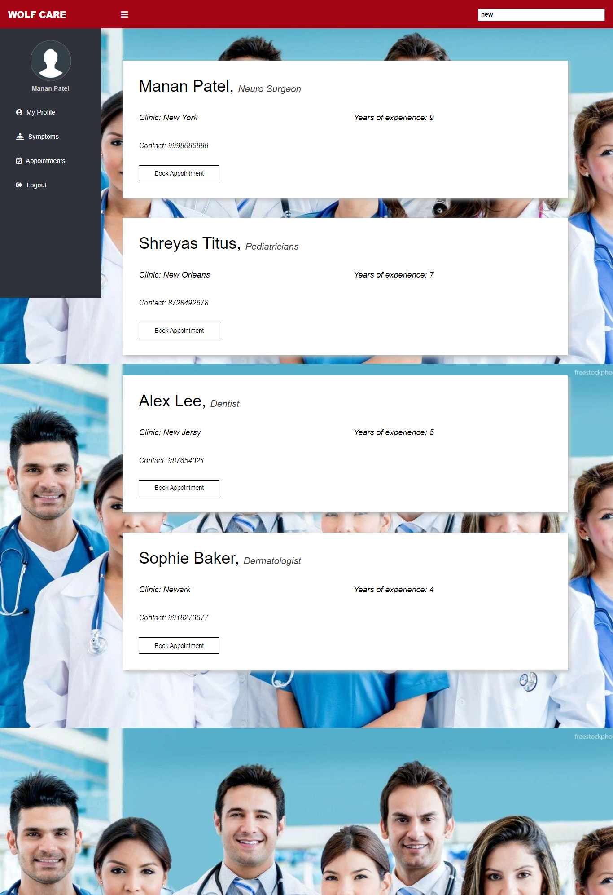

<p align="center">
  
<h1 align="center"> WolfCare </h1>
  
<h2 align="center"> Online Doctor Appointment and Symptoms Checker </h1>

<div align="center">
  <a href="https://github.com/divyagiridhar/SE-Group-25-WolfCare.git">
    
  </a>
  <a href="https://zenodo.org/badge/latestdoi/544594767">
    
  </a>
  <a href="https://github.com/divyagiridhar/SE-Group-25-WolfCare/blob/main/LICENSE">
    
  </a>
  <a href="https://github.com/divyagiridhar/SE-Group-25-WolfCare/graphs/contributors">
    
  </a>
  <a href="https://github.com/divyagiridhar/SE-Group-25-WolfCare/graphs/commit-activity">
    
  </a>
  <a href="https://github.com/divyagiridhar/SE-Group-25-WolfCare/issues">
    
  </a>
  <a href="https://github.com/divyagiridhar/SE-Group-25-WolfCare/issues?q=is%3Aissue+is%3Aclosed">
    
  </a>
  <a href="https://github.com/divyagiridhar/SE-Group-25-WolfCare/pulls">
    
  </a>
  <a href="https://github.com/divyagiridhar/SE-Group-25-WolfCare/pulls?q=is%3Apr+is%3Aclosed">
    
  </a>
  <a href="https://github.com/divyagiridhar/SE-Group-25-WolfCare/tags">
    
  </a>
  <a href="https://github.com/divyagiridhar/SE-Group-25-WolfCare">
    
  </a>
  <a href="https://github.com/divyagiridhar/SE-Group-25-WolfCare">
    
  </a>
  <a href="https://github.com/divyagiridhar/SE-Group-25-WolfCare/network/members">
    
  </a>
</div>

<h2> Table of Contents </h2>
<li> 
<a href="#overview"> About WolfCare </a> 
</li>
<li> 
<a href="#flowchart"> Flowchart </a> 
</li>
<li> 
<a href="#design"> Website Design </a> 
</li>
<li> 
<a href="#db"> Database Design </a> 
</li>
<li> 
<a href="#target audience"> Target Audience </a> 
</li>
<li> 
<a href="#tech"> Technologies </a> 
</li>
<li> 
<a href="#ig"> Installation Guide </a>
</li>
<li> 
<a href="#licenses"> License </a> 
</li>
<li> 
<a href="#cb"> Contributors </a>
</li>
<li> 
<a href="#help"> Help </a>
</li>
<br>

<h2 id = "overview"> About WolfCare </h2>

WolfCare is an online application that manages the health portfolio of the patient and provides doctor’s assistance through an online portal. A virtual doctor appointment booking system overrides the problems of booking an appointment manually. It is convenient, helps in better resource management and aids in syncing of calender schedules. This project provides a platform for the users to create an account, search for doctors at a given location, view the doctor's background and book appointments. Additionally, we have included a symptoms check where users can add theor test report values and view the results of a medical condition.  
<br>

<h2 id = "flowchart"> Flowchart </h2>
<div align = "center">
  
</div>
<br>

<h2 id = "design"> Website Design </h2>

<table border="2" bordercolorlight="#b9dcff" bordercolordark="#006fdd">

  <thead>
    <p> 1. Main Page </p>
    
  </thead>
  
  <tr style="background: #010203;"> 
    <td colspan = "2">
      <p style="color: #FF7A59"> 2. Welcome Page </p>  
            
     </td>
     <td colspan = "2">
      <p style="color: #FF7A59"> 3. Login Page </p>  
            
     </td>
  </tr>
   <tr style="background: #010203;"> 
    <td colspan = "2">
      <p style="color: #FF7A59"> 4. Home Page </p>  
            
     </td>
     <td colspan = "2"> 
      <p style="color: #FF7A59"> 5. Search Page </p>
        
    </td>
  </tr>
  </table>
<br>

<h2 id = "db"> Database Design</h2>

<table border="2" bordercolorlight="#b9dcff" bordercolordark="#006fdd">

  <thead>
    <p> 1. Main Database </p>
    
  </thead>
  
  <tr style="background: #010203;"> 
    <td colspan = "2">
      <p style="color: #FF7A59"> 2. Doctors' Database </p>  
            
     </td>
     <td colspan = "2">
      <p style="color: #FF7A59"> 3. Users' Database  </p>  
            
     </td>
  </tr>
  </table>
<br>

<h2 id = "target audience"> Target Audience </h2>
WolfCare targets uses who would like to check the presence of any medical conditions and book an appointment with a doctor. 
<br>
<br>

<h2 id = "tech"> Technologies </h2>

 &nbsp;  &nbsp;  &nbsp;  &nbsp; 
<br>
<br>

<h2 id = "ig"> Installation Guide </h2>
<ul>
<li> Clone the Github repository in your local system. </li> 
``` bash
git clone https://github.com/divyagiridhar/SE-Group-25-WolfCare.git
```
<li> This project uses xampp, so make sure to install xampp in your system. All the requirements of the project are listed in the `requirements.txt` file. </li>
</ul>
<br>

<h2 id = "licenses"> Licenses </h2>
<a href="https://github.com/divyagiridhar/SE-Group-25-WolfCare/blob/main/LICENSE"> MIT </a> License is used in this project. 
<br>
<br>

<h2 id = "help"> Help </h2>
You can email any queries to the contributors mentioned below.
<br>

<hr>
  <p id="cb" align = "center">
  |&nbsp; <a href = "mailto: rghevar@ncsu.edu">Ravi Ghevariya</a> &nbsp;| &nbsp; <a href = "mailto: dpatel49@ncsu.edu">Dhruv Patel</a> &nbsp;|&nbsp; <a href = "mailto: mrpatel8@ncsu.edu">Manan Patel</a> &nbsp;|&nbsp; <a href = "mailto: divyagiridhar97@gmail.com">Divya Giridhar</a> &nbsp;|&nbsp; <a href = "mailto: shreyastitus@gmail.com">Shreyas Titus</a> |
  </p>
<hr>
